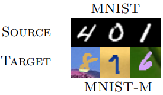
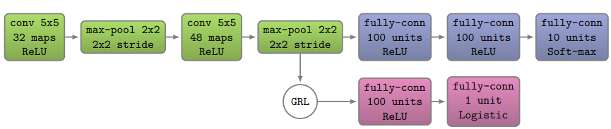

# DANN (Domain Adversarial Neural Network)-Pytorch
This repository provides a Pytorch implementation of DANN (Domain Adversarial Neural Networks) introduced by Ganin et al. [1]. The code includes the supporting scripts for reproducing the results obtained in [1] for the domain adaptation task, explicitly using the datasets mnist and mnist modified. 

# Pre-requisites
1- Python 3.7.4

2- Pytorch 1.13

Aiming at simplifying Python environment issues, we provide the [docker container](https://hub.docker.com/r/psoto87/pytorch1.13) used to conduct the experiments' results obtained with this code.

# Experiments
This code reproduces the experiments carried out among the mnist and mnist-modified datasets. The difference between such datasets is represented in the figure from [1].

Although other network architectures can be considered in this repository, here is expressly provided the network architectures used in [1] for mnist vs. mnist modified experiments. The following figure, also taken from [1], specifies the architectural details:

Additionally, during the experiments, the same set of hyper-parameters were used.

# Results
The results were computed regarding Accuracy and F1-Score; the following table shows them.

|               Source |   Mnist  |          |
|---------------------:|:--------:|----------|
|               Target |  Mnist-M |          |
|              Metrics | Accuracy | F1-Score |
| No Domain Adaptation |    45    |   49.8   |
|         DANN         |   70.4   |   70.8   |

# References
[1] Ganin and V. Lempitsky, “Unsupervised   domain   adaptation  by backpropagation,”arXiv preprint arXiv:1409.7495, 2014.

